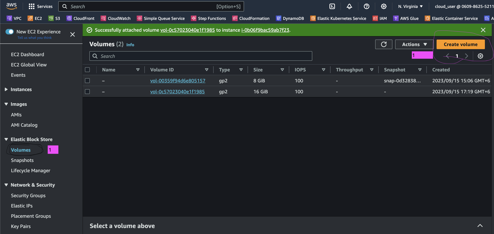
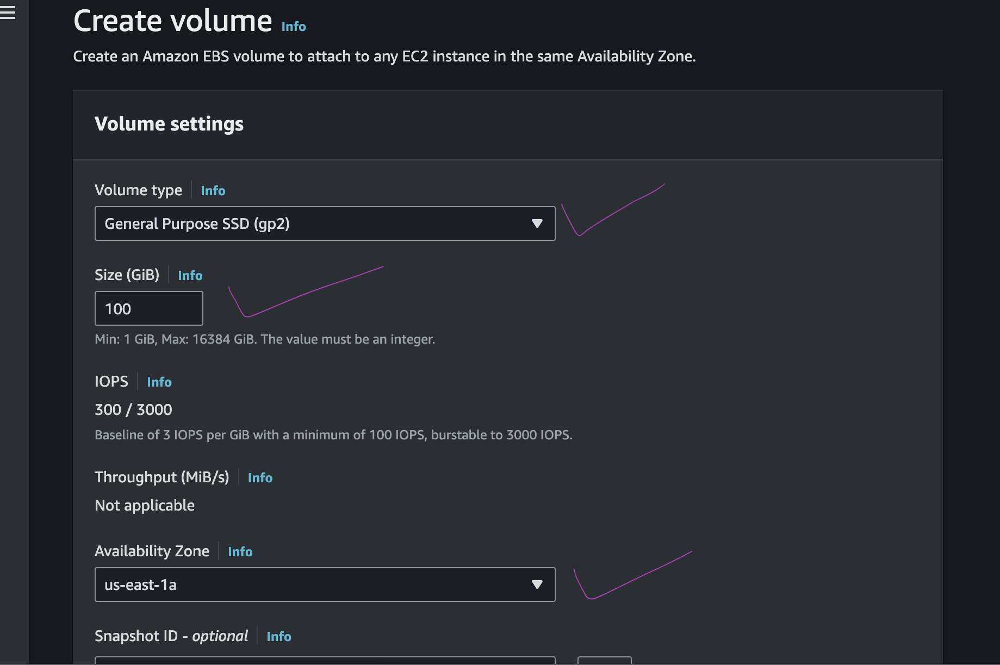
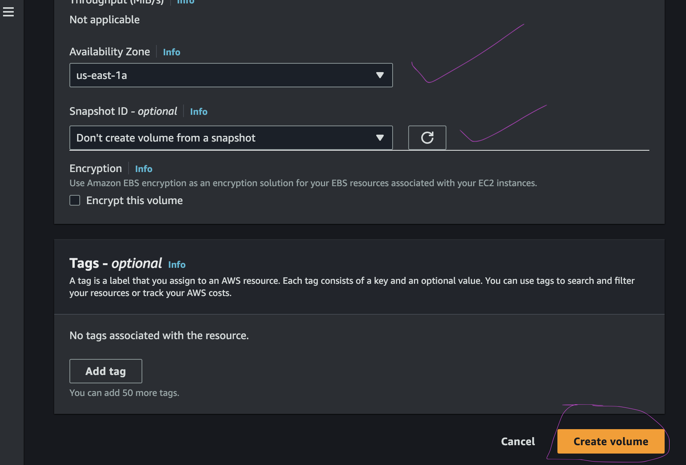
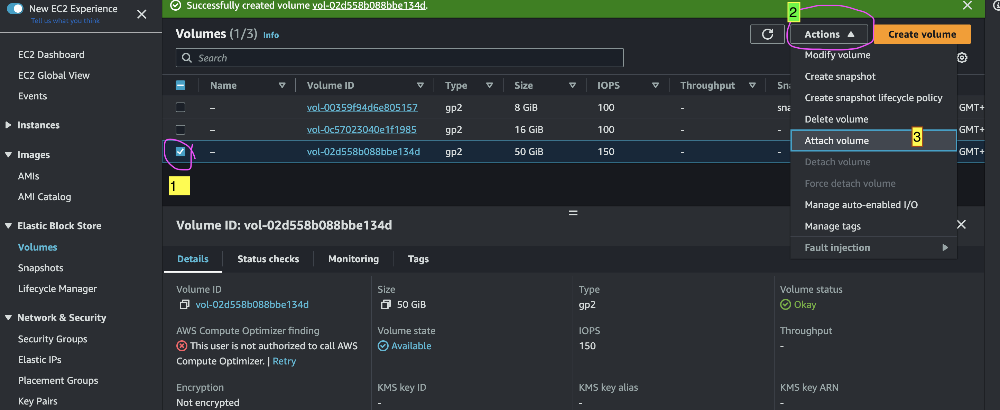
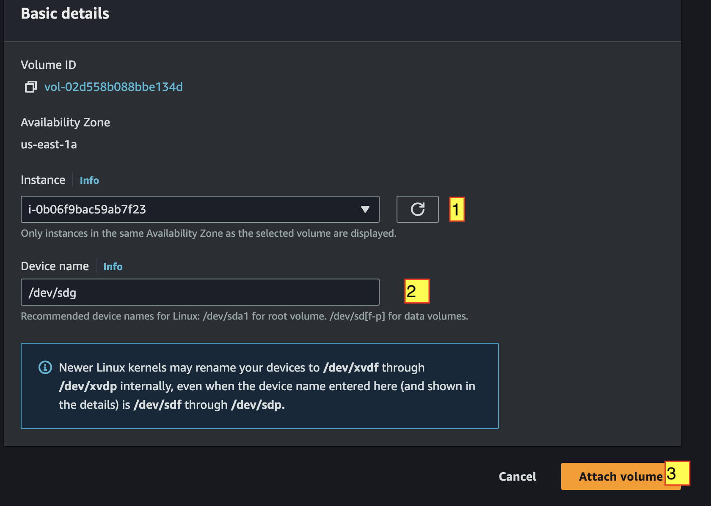
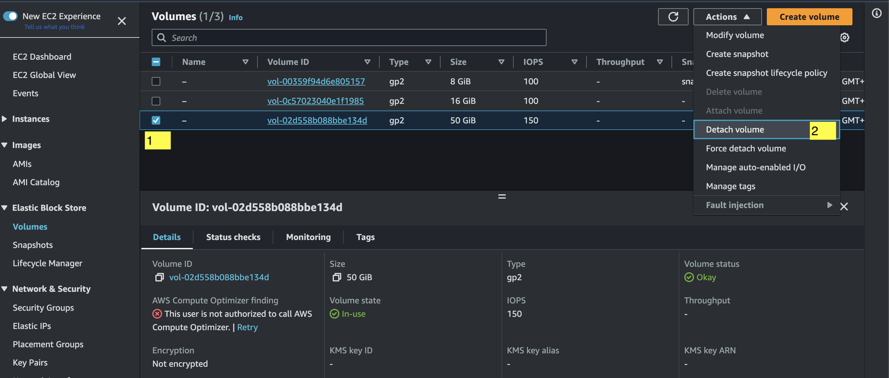

# create ebs volumne from aws volume block add image 
<table>
  <tr>
    <td valign="top"></td>
    <td valign="top"> </td>
    <td valign="top"> </td>
  </tr>
</table>

# After create the ebs volume we need to crate add to our selected ec2.

<table>
  <tr>
    <td valign="top"></td>
    <td valign="top"> </td>
  </tr>
</table>


### To show the ebs volume on cli 
```bash
  #!/bin/bash
lsblk # to show the ebs volume
mkdir mountfile
sudo mkfs.ext4 /dev/xvdf  #type-name-of-valumne=/dev/xvdf here this line formate the ebs volume
sudo su # go to root 
cd / # go inside root directory
ls # show all file
mount /dev/xvdf /mountfile
mountpoint /mountfile # for check volume file mount or not 
umount /mountfile 
```
# Detech the the volume 
<table>
  <tr>
    <td valign="top"></td>
    
  </tr>
</table>
